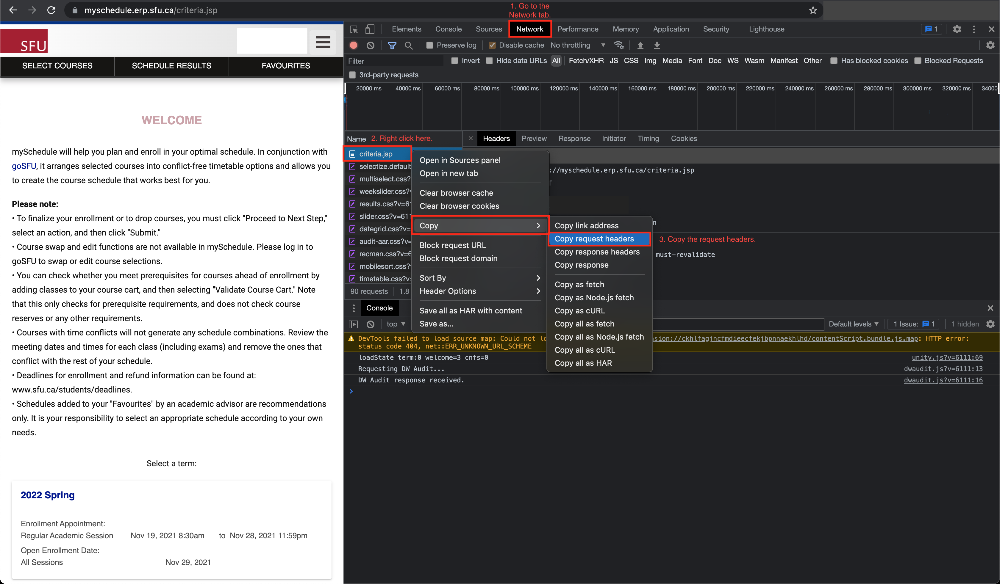

# SFU-CMPT-Prereq-Tree
This Python automation tool uses to draw all computing science pre-requsite courses in Simon Fraser University in a form of tree.

### Prerequisites
This tool is developed under the following environment:
```
python --version
>> Python 3.9.9
```

### Installing dependencies and required libraries (Debian/Ubuntu/Mac)
```bash
sudo ./setup.sh
```

### Running

First, you will need to fetch a list of available courses through MySchedule.

To do this, you will need the cookie containing your session token. Getting this process will vary by browser, but you will essentially need to log in to `myschedule.sfu.ca` and use your browser to copy the request headers.

> **Note:** The `document.cookie` variable *does not* contain the session token. If you try using that, it *will not work*. You *must* use your browser's developer tools to copy the entire `Cookie: ...` header somehow.

<details>
<summary>For Google Chrome</summary>
<div markdown="1">

Press <kbd>F12</kbd> (or <kbd>Fn+F12</kbd> on Mac), and the developer tools should pop up. Click on the `Network` tab. Chrome should now start recording network requests.

Now, refresh the page. You should notice a bunch of network requests are listed. Right click on the one the says `criteria.jsp`, and do `Copy` -> `Copy request headers`.



</div>
</details>

With that copied, it's time to fetch the courses and generate the graph. You can use `run.sh`, or manually run `get-courses.py` followed by `main.py` using Python 3:

When `get-courses.py` is run, it will ask you to paste the request headers that you just extracted from your browser. Paste them into the terminal, then press <kbd>Enter</kbd>. If everything goes well, you should see output like:

```
[log] Fetching term IDs...
[log] Searchng CMPT120 in term 2022 Spring...
[log] Searchng CMPT125 in term 2022 Spring...
[log] Searchng CMPT127 in term 2022 Spring...
[log] Searchng CMPT225 in term 2022 Spring...
[log] Searchng CMPT276 in term 2022 Spring...
[log] Searchng CMPT295 in term 2022 Spring...
[log] Searchng MACM101 in term 2022 Spring...
[log] Searchng MACM201 in term 2022 Spring...
[log] Searchng MATH151 in term 2022 Spring...
[log] Searchng MATH152 in term 2022 Spring...
[log] Searchng MATH240 in term 2022 Spring...
[log] Searchng STAT270 in term 2022 Spring...
[log] Searchng CMPT376W in term 2022 Spring...
```

Once the courses have been fetched, `main.py` will generate a graph of course prequisites. Look inside the `result` folder for `tree.dot.svg` and `sample-tree.dot.svg`.
